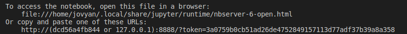
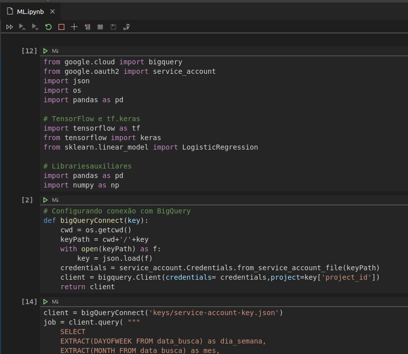

# Datascience Minimum Stack

- Docker, Jupyter, Tensorflow e BigQuery

### Jupyter Notebook no VSCode

- Instale a extensão Python para o VSCode
- Inicie o container: `docker-compose up -d`
- Obtenha token de acesso: No VSCode, vá na lista de containers, clique com botão direito no container "jupyter" e selecione "View Logs", depois procure pelo trecho abaixo:



- Inclua este caminho nas configuração do ambiente do VSCode: 

```
{
    "python.dataScience.jupyterServerURI": "http://127.0.0.1:8888/?token=3a0759b0cb51ad26de4752849157113d77adf37b39a8a358"
}

```

- Por fim abra o arquivo "jupyter/ML.ipynb" e *voilà* você agora tem um Jupyter Notebook dentro do VSCode.



